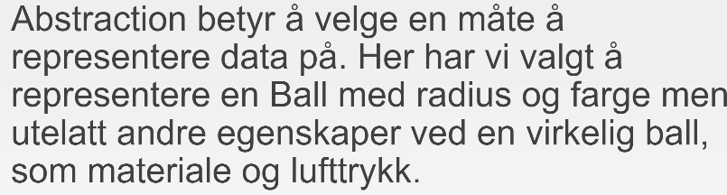

# Abstraction

*Fokuser på det viktigste og gjør det enkelt*

*Dependency*

Klasser som er avhenging av andre klasser for å virke.

Feks `public class CoolGrid extends IGrid` her er Grid en dependency

**Tetris:**
- Skjer på et «spillbrett» som er et «rutenett»
- Det finnes forskjellige «klosser» av 4 «ruter»
- En kloss er aktiv på brettet
- Aktiv kloss faller nedover i bestemt fart
- Spiller kontrollerer aktiv kloss med pilene
- Brettet vises grafisk på skjermen
- Målet er å lage fulle rader som da forsvinner
