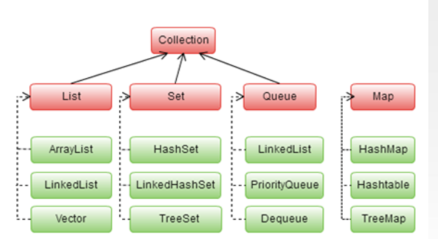

# Collections

*Collection er bare en bestefar til List, ArrayList og mange andre*

En Collection brukes til å lagre en datamengde (i stedet for arrays e.g. int[ ])

Har metodene : `size()`, `isEmpty()`, `contains()`, `add()`, `remove()`

Så kommer barna: 

- List med `indexOf()`, `get()`, `set()`

- Set med `addAll()`, `retainAll()`, `removeAll()`

- Queue med `poll()`, `offer()`, `peek()`

Map og dermed HashMap arver ikke av Collection.

- Hashmap med `put()`, `get()`, `remove()`

