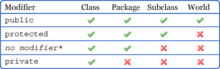

# Encapsulation

*Unngå bugs.. Hver del av koden skal ha ansvar for en ting.*



When you have a felt-variabel it is important to keep it private.
You can allow others to acess it through a getter.

Example:

```java

public class Person{

    private String name;
    private final ArrayList<Person> friends;

    public Person(String name, ArrayList<Person> friends){
        this.name = name;
        this.friends = friends;
    }

    public String getName(){
        return this.name // encapsulation (immutable)
    }
    public String getFriendsMutable(){ 
        return this.friends; // encapsulation (mutable)
        // since arraylist is mutable, other classes can mess with it (even if final)
    }
    public String getFriendsImmutable(){ 
        // further than encapsulation, keeping stuff private
        // prevents people from messing with the variable
        return new ArrayList<>(this.friends); 
    }
}
```
### Data invariant
Noen objekter har krav som må holde til en
hver tid

Feks at ett trafikklys kan være i 1 av 4 tilstander.

Eller at en persons alder MÅ være dato - fødselsdato

Må ALLTID overholdes!
